**SENG 438 - Software Testing, Reliability, and Quality**

**Lab. Report #3 – Code Coverage, Adequacy Criteria and Test Case Correlation**

| Group \#: | 27      |
| --------- | ------- |
| Jared     | Assen   |
| John      | Delsing |
| Ethan     | Kerr    |
| Tyler     | Thain   |

(Note that some labs require individual reports while others require one report
for each group. Please see each lab document for details.)

# 1 Introduction

In this lab our group looked back on Assignment 2 and used a new coverage tool EclEmma to determine the coverage. We then made new unit tests in order to increase the total coverage and reported the results

** Please note the EclEmma does not have condition coverage so we used method coverage instead **

For rangeTest, the initial statement coverage was 35.3%, branch coverage was 35.4%, and method coverage was 47.8%.

// add Data Utilities Test

# 2 Manual data-flow coverage calculations for DataUtillities.calculateColumnTotal and Range.Constraint

## Range.Constraint:

Def-Use Sets Per Statement:
|Line|Defs |Uses |
|----|------|-----------------|
|1 |value | |
|2 |result|value |
|3 | |value |
|4 | |value, this.upper|
|5 |result|this.upper |
|7 | |value, this.lower|
|8 |result|this.lower |
|11 | |result |

Def-Use Pairs Per Variable:
|Variables |Pairs (def, use) |
|-----------|-------------------------------|
|value |(1, 2), (1, 3), (1, 4), (1, 7) |
|result |(2, 11), (5, 11), (8, 11) |
|this.upper |(0, 4), (0, 5) |
|this.lower |(0, 7), (0, 8) |

Pairs Covered By Each Test:

<table>
  <tr>
   <td><strong>Test</strong>
   </td>
   <td><strong>Variables</strong>
   </td>
   <td><strong>Pairs</strong>
   </td>
  </tr>
  <tr>
   <td rowspan="4" >belowRangeTest
   </td>
   <td>value
   </td>
   <td>(1, 2), (1, 3), (1, 4), (1, 7)
   </td>
  </tr>
  <tr>
   <td>result
   </td>
   <td>(8, 11)
   </td>
  </tr>
  <tr>
   <td>this.upper
   </td>
   <td>(0, 4)
   </td>
  </tr>
  <tr>
   <td>this.lower
   </td>
   <td>(0, 7), (0, 8)
   </td>
  </tr>
  <tr>
   <td rowspan="4" >onLowerBoundTest
   </td>
   <td>value
   </td>
   <td>(1, 2)
   </td>
  </tr>
  <tr>
   <td>result
   </td>
   <td>(2, 11)
   </td>
  </tr>
  <tr>
   <td>this.upper
   </td>
   <td>
   </td>
  </tr>
  <tr>
   <td>this.lower
   </td>
   <td>
   </td>
  </tr>
  <tr>
   <td rowspan="4" >withinRangeTest
   </td>
   <td>value
   </td>
   <td>(1, 2), (1, 3)
   </td>
  </tr>
  <tr>
   <td>result
   </td>
   <td>(2, 11)
   </td>
  </tr>
  <tr>
   <td>this.upper
   </td>
   <td>
   </td>
  </tr>
  <tr>
   <td>this.lower
   </td>
   <td>
   </td>
  </tr>
  <tr>
   <td rowspan="4" >onUpperBoundTest
   </td>
   <td>value
   </td>
   <td>(1, 2), (1, 3)
   </td>
  </tr>
  <tr>
   <td>result
   </td>
   <td>(2, 11)
   </td>
  </tr>
  <tr>
   <td>this.upper
   </td>
   <td>
   </td>
  </tr>
  <tr>
   <td>this.lower
   </td>
   <td>
   </td>
  </tr>
  <tr>
   <td rowspan="4" >aboveRangeTest
   </td>
   <td>value
   </td>
   <td>(1, 2), (1, 3), (1, 4), (1, 7)
   </td>
  </tr>
  <tr>
   <td>result
   </td>
   <td>(5, 11)
   </td>
  </tr>
  <tr>
   <td>this.upper
   </td>
   <td>(0, 4), (0, 5)
   </td>
  </tr>
  <tr>
   <td>this.lower
   </td>
   <td>(0, 7)
   </td>
  </tr>
</table>

Pair Coverage: 100% (all pair covered)

## DataUtilities.calculateColumnTotal:

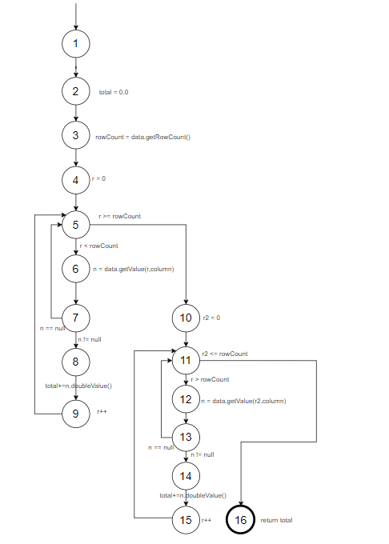

Def-Use Sets Per Statement: 

<table>
  <tr>
   <td><strong>Line</strong>

   </td>
   <td><strong>Defs</strong>

   </td>
   <td><strong>Uses</strong>

   </td>
  </tr>
  <tr>
   <td>1

   </td>
   <td>data, column

   </td>
   <td>
   </td>
  </tr>
  <tr>
   <td>2

   </td>
   <td>
   </td>
   <td>data

   </td>
  </tr>
  <tr>
   <td>3

   </td>
   <td>total

   </td>
   <td>
   </td>
  </tr>
  <tr>
   <td>4

   </td>
   <td>rowCount

   </td>
   <td>data

   </td>
  </tr>
  <tr>
   <td>5

   </td>
   <td>r

   </td>
   <td>rowCount, r

   </td>
  </tr>
  <tr>
   <td>6

   </td>
   <td>n

   </td>
   <td>data, column, r

   </td>
  </tr>
  <tr>
   <td>7

   </td>
   <td>
   </td>
   <td>n

   </td>
  </tr>
  <tr>
   <td>8

   </td>
   <td>
   </td>
   <td>total, n

   </td>
  </tr>
  <tr>
   <td>11

   </td>
   <td>r2

   </td>
   <td>rowCount, r2

   </td>
  </tr>
  <tr>
   <td>12

   </td>
   <td>n

   </td>
   <td>data, column, r2

   </td>
  </tr>
  <tr>
   <td>13

   </td>
   <td>
   </td>
   <td>n

   </td>
  </tr>
  <tr>
   <td>14

   </td>
   <td>
   </td>
   <td>total, n

   </td>
  </tr>
  <tr>
   <td>17

   </td>
   <td>
   </td>
   <td>total

   </td>
  </tr>
</table>

Def-Use Pairs Per Variable:

<table>
  <tr>
   <td><strong>Variable</strong>

   </td>
   <td><strong>Pairs (def, use)</strong>

   </td>
  </tr>
  <tr>
   <td>data

   </td>
   <td>(1,2), (1,4), (1,6), (1,12)

   </td>
  </tr>
  <tr>
   <td>column

   </td>
   <td>(1,6), (1,12)

   </td>
  </tr>
  <tr>
   <td>total

   </td>
   <td>(3,8), (3,14), (3,17)

   </td>
  </tr>
  <tr>
   <td>rowCount

   </td>
   <td>(4,5), (4,11)

   </td>
  </tr>
  <tr>
   <td>r

   </td>
   <td>(5,5), (5,6)

   </td>
  </tr>
  <tr>
   <td>n

   </td>
   <td>(6,7), (6,8), (12,13), (12,14)

   </td>
  </tr>
  <tr>
   <td>r2

   </td>
   <td>(11,11), (11,12)

   </td>
  </tr>
</table>

Pairs Covered By Each Test:

<table>
  <tr>
   <td><strong>Test</strong>
   </td>
   <td><strong>Variables</strong>
   </td>
   <td><strong>Pairs</strong>
   </td>
  </tr>
  <tr>
   <td rowspan="7" >validInputTest
   </td>
   <td>data
   </td>
   <td>(1,2), (1,4), (1,6)
   </td>
  </tr>
  <tr>
   <td>column
   </td>
   <td>(1,6)
   </td>
  </tr>
  <tr>
   <td>total
   </td>
   <td>(3,8), (3,17)
   </td>
  </tr>
  <tr>
   <td>rowCount
   </td>
   <td>(4,5), (4,11)
   </td>
  </tr>
  <tr>
   <td>r
   </td>
   <td>(5,5), (5,6)
   </td>
  </tr>
  <tr>
   <td>n
   </td>
   <td>(6,7), (6,8)
   </td>
  </tr>
  <tr>
   <td>r2
   </td>
   <td>(11,11)
   </td>
  </tr>
  <tr>
   <td>nullDataTest
   </td>
   <td>data
   </td>
   <td>(1,2)
   </td>
  </tr>
  <tr>
   <td>negativeIndexTest
   </td>
   <td>data
   </td>
   <td>(1,2)
   </td>
  </tr>
  <tr>
   <td rowspan="6" >tooLargeIndexTest
   </td>
   <td>data
   </td>
   <td>(1,2), (1,4), (1,6)
   </td>
  </tr>
  <tr>
   <td>column
   </td>
   <td>(1,6)
   </td>
  </tr>
  <tr>
   <td>total
   </td>
   <td>(3,8)
   </td>
  </tr>
  <tr>
   <td>rowCount
   </td>
   <td>(4,5)
   </td>
  </tr>
  <tr>
   <td>r
   </td>
   <td>(5,5), (5,6)
   </td>
  </tr>
  <tr>
   <td>n
   </td>
   <td>(6,7), (6,8)
   </td>
  </tr>
</table>

Pair Coverage: 13/19 = 68.42%

# 3 A detailed description of the testing strategy for the new unit test

We first began by examining the current code coverage achieved by our black box unit tests from Assignment 2. We then tackled statement coverage first. Using EclEmma, we were able to see which lines of the source code for Range and DataUtilities were being executed by our existing tests. From there, we examined the control flow structure of the different methods. We wrote unit tests according to the documentation, incorporating cases that will trigger different control flow blocks to reach code that was not reached by our original tests. Additionally, DataUtilities got four new methods in the new version of the code. These were obviously not covered by our existing test suite, so we were able to increase our statement coverage significantly by writing basic tests for those new methods. After reaching our statement coverage goals, we then turned to branch coverage. Our efforts to meet statement coverage goals also increased out branch coverage significantly, but not quite to the appropriate level. We examined which branch directions were covered by our existing statement coverage tests, and then wrote tests according to the documentation to make the control flow statement evaluate to true if the previous test made it false, and vice-versa. Writing a few of these tests for each method in Range and DataUtilities increased our branch coverage to above the required level. Finally, since EclEmma does not have condition coverage capabilities, we used method coverage for our last metric as suggested in the lab manual. Our efforts increasing coverage in the other two metrics meant that we wrote tests for each method, and thus our method coverage was 100%. In general, our strategy was to first read and understand the code and its control flow. We then wrote tests to exercise different parts of the code according to those control flow structures in order to achieve our goal coverages.

# 4 A high level description of five selected test cases you have designed using coverage information, and how they have increased code coverage

Text…

# 5 A detailed report of the coverage achieved of each class and method (a screen shot from the code cover results in green and red color would suffice)

## _Range_:

## _Statement:_

## _Branch:_

## _Method:_

## _DataUtilities_:

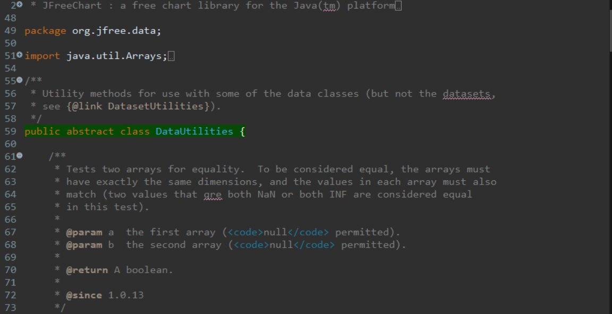
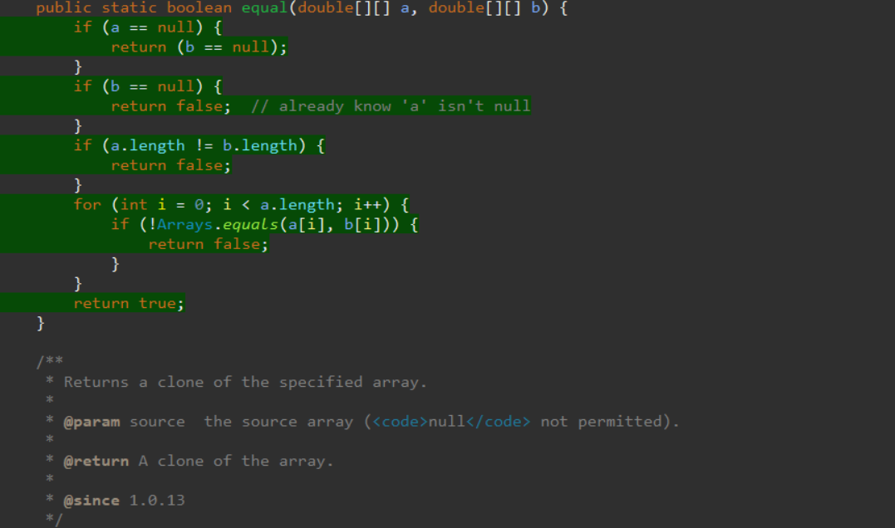
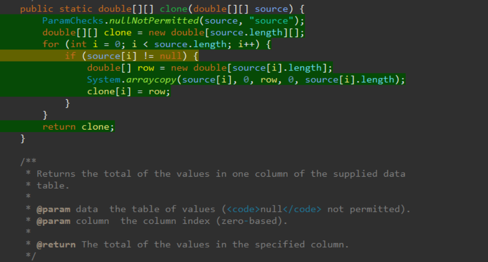
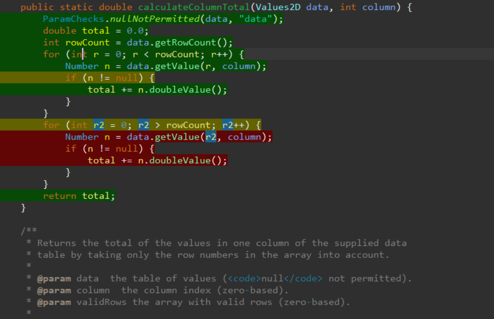

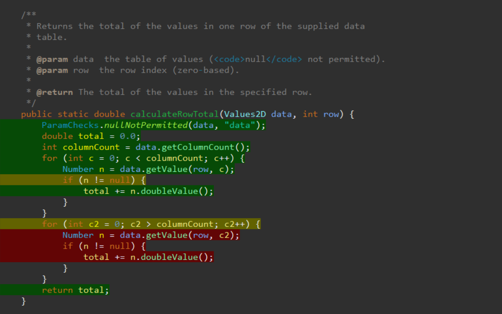
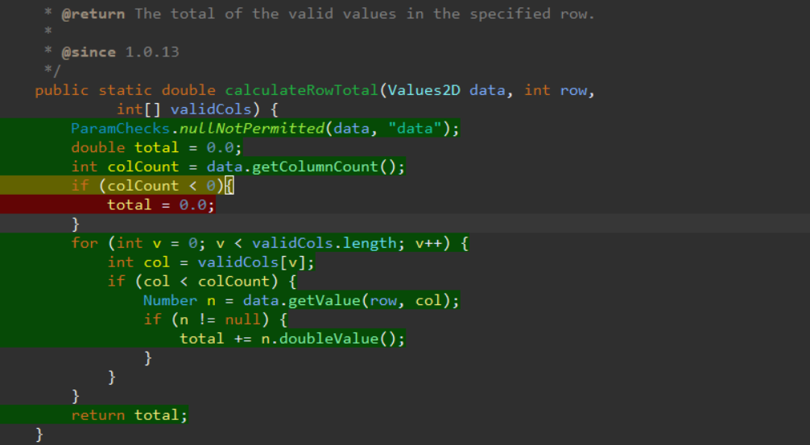
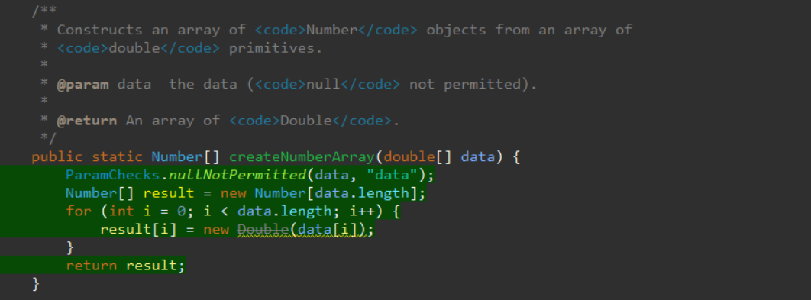
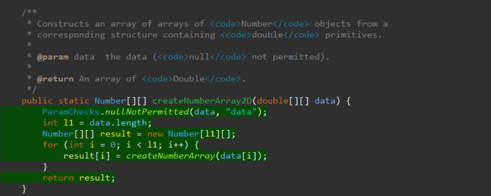
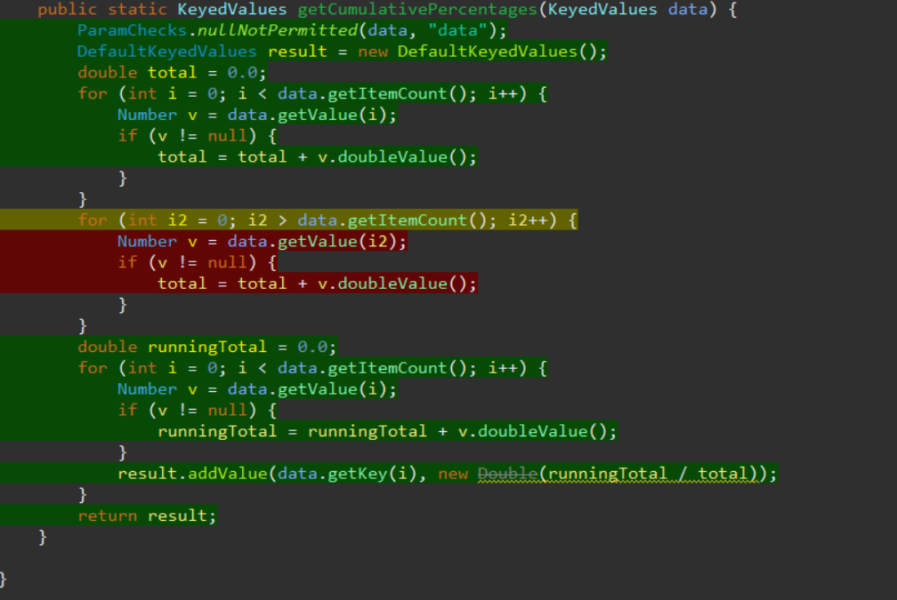

## _Statement:_

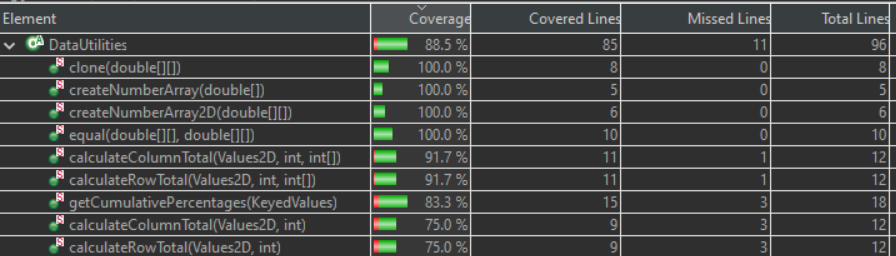

**Please note:** statement coverage for DataUtilities is only 88.5%, and not the required 90%. This is because 11 total lines of code in DataUtilities methods are unreachable. The first cases are in calculateColumnTotal(Values2D data, int column) and calculateRowTotal(Values2D data, int row). There is a for loop in each of these methods which can never execute, because the conditional statement in the loop definition requires that there be a negative number of columns or rows respectively. This is a state that we cannot impose upon a Values2D object, and thus we cannot ever trigger this conditional and execute the code in the loop. This accounts for 6 of the 11 lines. 3 more lines can be found in getCumulativePercentages(KeyedValues data), where there is again another for loop containing unreachable code. The conditional requires the number of key-value pairs to be negative, which is not a state we can impose upon a KeyedValues object. The final 2 lines of code are found in calculateColumnTotal(Values2D data, int column, int[] validRows) and calculateRowTotal(Values2D data, int row, int[] validCols). In both of these methods, double total is initialized to 0.0. Then, total is checked to see if it is less than zero, and if it is, it gets set to 100. This condition can never be met, because a variable initialized to zero and then immediately compared to zero will never be less than zero. These cases make up the 11 lines of unreachable code in DataUtilities, and since we have covered every other statement in the class, we are unable to increase the statement coverage any further.

## _Branch:_

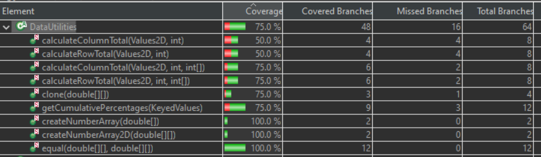

## _Method:_

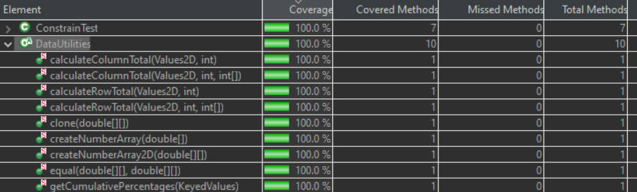

# 6 Pros and Cons of coverage tools used and Metrics you report

There are a number of pros to the coverage tool we used, EclEmma. The first of which is that it highlighted the coverage of our tests on the source code in a very identifiable way. We were able to quickly figure out what lines of code needed more coverage, and which branches were not entirely covered. This allowed us to identify the deficiencies in our original black-box tests, and helped us develop a testing plan to meet the coverage requirements. Another benefit was the level of detail we could get about coverage. Not only could we see the coverage for the entire Range or DataUtilities class, but we could see coverage of individual member methods. This allowed us to find the specific methods that were lacking coverage, and increase total code coverage much faster. Line and branch coverage metrics are important metrics to consider in a test suite. They allow one to identify what percentage of code statements are executed by the suite, as well as what percentage of branches are taken by the test suite. Covering more branches and more statements increases the chances of finding bugs, and increases confidence that bugs do not exist when you do not catch them with your unit tests. EclEmma is very easy to use with those metrics.

EclEmma is not without its issues though. Firstly, EclEmma lacks a conditional coverage metric. We therefore used the method coverage metric, as suggested by the lab instructions. However, method coverage is a much less useful coverage metric, and tells you a lot less about what aspects of the code you are testing. Another issue is that EclEmma did not work well with our mocking framework. It would not account for certain sections of code that interacted with the mock, and so we were forced to actually instantiate dependencies, which weakens our tests. Our tests that use those dependencies now rely on the proper implementation of the dependency in order to ensure that our test works correctly.

# 7 A comparison on the advantages and disadvantages of requirements-based test generation and coverage-based test generation.

<h3>Requirements-Testing:</h3>

<h3>Coverage-Testing:</h3>

# 8 A discussion on how the team work/effort was divided and managed

We split the work evenly among the team, with two members working on meeting coverage requirements for Range, and two members working on DataUtilities. For the manual data-flow coverage calculation, each sub-team of two worked on the respective method from Range or DataUtilities. This seemed to split the workload evenly. Additionally, to fill out the lab report, all of the team members met together to work collaboratively on the document. Each member would select a section, and work on it, with edits and additional contributions to each section made by other members. We managed the workload by remaining active in our group chat and communicating with each other often and clearly.

# 9 Any difficulties encountered, challenges overcome, and lessons learned from performing the lab

There were some challenges encountered early on in the lab. The setup took a bit of tinkering to get the coverage framework working properly, though those challenges were overcome rather quickly. The next challenge we encountered was that EclEmma did not interact properly with our mocking framework. We therefore had to edit our testing suite to remove the mocks, and instead instantiate the objects outright. This poses a bit of an issue in terms of the rigor of the unit tests, because each test is not depending upon the correct implementation of another unit of code. Once we removed our mocks, the coverage tool began working properly.
We learned a lot about the principles of white-box testing, and how to better analyze the control flow of a unit of code. We also learned how to use code coverage metrics to improve our test suite. We analyzed our original coverage, and used that information to determine where we needed to increase coverage. Additionally, we went through the manual process of calculating pair coverage which gave us a deeper understanding of how coverage tools work. White-box testing is extremely valuable in uncovering bugs that may be hidden from black-box testing, as well as unexpected behaviour that deviates from or is not mentioned in specifications.

# 10 Comments/feedback on the lab itself

Our group came into this lab with limited practical experience with white-box testing techniques but the lab documents explained the process very well. Giving a list of coverage tools was very helpful as well as the disclaimer that not all testing tools would be able to do everything required. This lab provided a good overview of manual data-flow coverage techniques and a good overview of using coverage values to improve a test suite. The only thing we ran into problems with in this lab was the change in documentation from the second lab. In the second lab, many of the methods explicitly stated what exceptions would be thrown so we wrote our black box tests based on the stated exceptions. However, in this lab the method documentation did not mention what exceptions would be thrown and the exceptions thrown were different from what was stated in the documentation for lab two. We decided to assume that the code was correct for this lab but this required us to rewrite some test cases from our first lab instead of being able to just migrate the test suite over.
