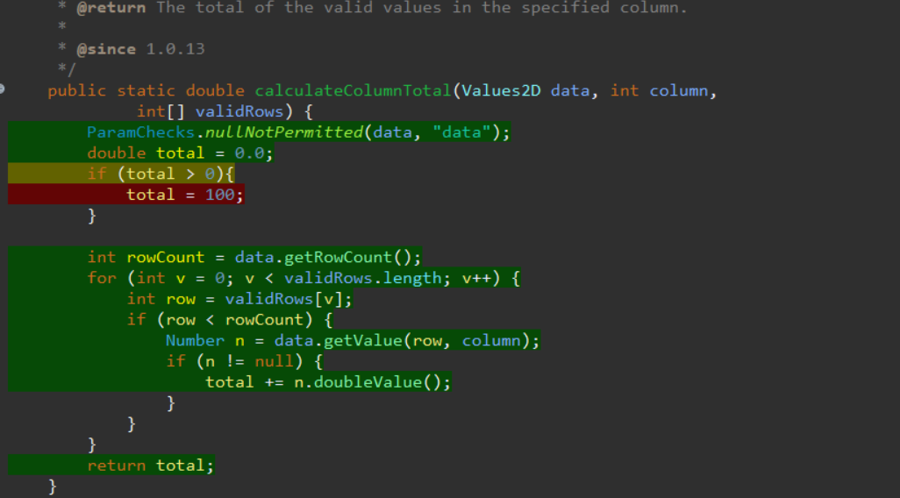

**SENG 438 - Software Testing, Reliability, and Quality**

**Lab. Report #3 – Code Coverage, Adequacy Criteria and Test Case Correlation**

| Group \#:   |    27     |
| -------------- | ------- |
| Jared          | Assen   |
| John           | Delsing |
| Ethan          | Kerr    |
| Tyler          | Thain   |

(Note that some labs require individual reports while others require one report
for each group. Please see each lab document for details.)

# 1 Introduction

In this lab our group looked back on Assignment 2 and used a new coverage tool EclEmma to determine the coverage. We then made new unit tests in order to increase the total coverage and reported the results 

** Please note the EclEmma does not have condition coverage so we used method coverage instead **

For rangeTest, the initial statement coverage was 35.3%, branch coverage was 35.4%, and method coverage was 47.8%. 

// add Data Utilities Test

# 2 Manual data-flow coverage calculations for DataUtillities.calculateColumnTotal and Range.Constraint

Range.Constraint:

Def-Use Sets Per Statement:
|Line|Defs  |Uses             |
|----|------|-----------------|
|1   |value |                 |
|2   |result|value            |
|3   |      |value            |
|4   |      |value, this.upper|
|5   |result|this.upper       |
|7   |      |value, this.lower|
|8   |result|this.lower       |
|11  |      |result           |

Def-Use Pairs Per Variable:
|Variables  |Pairs (def, use)               |
|-----------|-------------------------------|
|value      |(1, 2), (1, 3), (1, 4), (1, 7) |
|result     |(2, 11), (5, 11), (8, 11)      |
|this.upper |(0, 4), (0, 5)                 |
|this.lower |(0, 7), (0, 8)                 |

Pairs Covered By Each Test:

<table>
  <tr>
   <td><strong>Test</strong>
   </td>
   <td><strong>Variables</strong>
   </td>
   <td><strong>Pairs</strong>
   </td>
  </tr>
  <tr>
   <td rowspan="4" >belowRangeTest
   </td>
   <td>value
   </td>
   <td>(1, 2), (1, 3), (1, 4), (1, 7)
   </td>
  </tr>
  <tr>
   <td>result
   </td>
   <td>(8, 11)
   </td>
  </tr>
  <tr>
   <td>this.upper
   </td>
   <td>(0, 4)
   </td>
  </tr>
  <tr>
   <td>this.lower
   </td>
   <td>(0, 7), (0, 8)
   </td>
  </tr>
  <tr>
   <td rowspan="4" >onLowerBoundTest
   </td>
   <td>value
   </td>
   <td>(1, 2)
   </td>
  </tr>
  <tr>
   <td>result
   </td>
   <td>(2, 11)
   </td>
  </tr>
  <tr>
   <td>this.upper
   </td>
   <td>
   </td>
  </tr>
  <tr>
   <td>this.lower
   </td>
   <td>
   </td>
  </tr>
  <tr>
   <td rowspan="4" >withinRangeTest
   </td>
   <td>value
   </td>
   <td>(1, 2), (1, 3)
   </td>
  </tr>
  <tr>
   <td>result
   </td>
   <td>(2, 11)
   </td>
  </tr>
  <tr>
   <td>this.upper
   </td>
   <td>
   </td>
  </tr>
  <tr>
   <td>this.lower
   </td>
   <td>
   </td>
  </tr>
  <tr>
   <td rowspan="4" >onUpperBoundTest
   </td>
   <td>value
   </td>
   <td>(1, 2), (1, 3)
   </td>
  </tr>
  <tr>
   <td>result
   </td>
   <td>(2, 11)
   </td>
  </tr>
  <tr>
   <td>this.upper
   </td>
   <td>
   </td>
  </tr>
  <tr>
   <td>this.lower
   </td>
   <td>
   </td>
  </tr>
  <tr>
   <td rowspan="4" >aboveRangeTest
   </td>
   <td>value
   </td>
   <td>(1, 2), (1, 3), (1, 4), (1, 7)
   </td>
  </tr>
  <tr>
   <td>result
   </td>
   <td>(5, 11)
   </td>
  </tr>
  <tr>
   <td>this.upper
   </td>
   <td>(0, 4), (0, 5)
   </td>
  </tr>
  <tr>
   <td>this.lower
   </td>
   <td>(0, 7)
   </td>
  </tr>
</table>

Pair Coverage: 100% (all pair covered)

DataUtilities.calculateColumnTotal:

# 3 A detailed description of the testing strategy for the new unit test

Text…

# 4 A high level description of five selected test cases you have designed using coverage information, and how they have increased code coverage

Text…

# 5 A detailed report of the coverage achieved of each class and method (a screen shot from the code cover results in green and red color would suffice)

## _Range_: 

## _Statement:_

## _Branch:_

## _Method:_

## _DataUtilities_: 

## _Statement:_

## _Branch:_

## _Method:_ 

# 6 Pros and Cons of coverage tools used and Metrics you report

There are many pros of using EclEmma that were highlighted while we completed this lab. One was that it made it very easy to see the actual coverage that our test cases provided and where we needed to make new ones. Also, it worked well with mockery so we could continue to use mocking in our testing. By seeing the coverage we were easily able to determine how to improve tests and make effective test cases. 

A con that could be considered is that EclEmma does not have every coverage tool. This was seen as out group had to use method coverge instead of condition coverage. 

# 7 A comparison on the advantages and disadvantages of requirements-based test generation and coverage-based test generation.

<h3>Requirements-Testing:</h3>

<h3>Coverage-Testing:</h3>

# 8 A discussion on how the team work/effort was divided and managed

Text…

# 9 Any difficulties encountered, challenges overcome, and lessons learned from performing the lab

Text…

# 10 Comments/feedback on the lab itself

Text…
